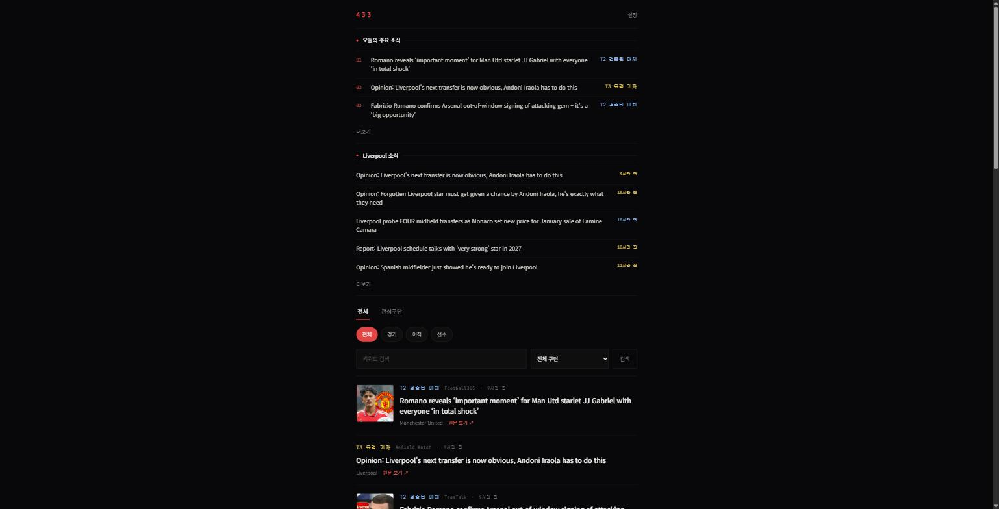
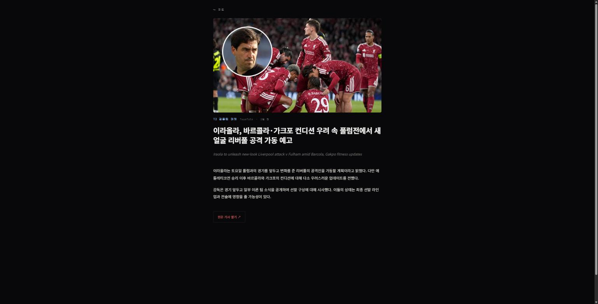

# 433

해외축구 뉴스를 모아 한국어로 번역해 보여주는 웹 앱입니다(서비스명 "433", 2026-09-11 확정 —
백엔드 패키지명 `com.liverpool.news`·폴더명 `liverpool-news-app`은 리네이밍 리스크가 커
이번 범위에서 유지, 사용자에게 노출되는 텍스트만 변경). 리버풀 팬 매체는 항상 포함하고,
그 외 대형/전문 매체는 기사 본문에서 언급된 구단을 자동 감지해 태깅합니다. 출처 신뢰도
등급과 유명 기자 인용 감지로 루머와 사실을 구분하고, 같은 이적 건을 타임라인으로 묶어
여러 매체가 교차 보도했는지도 보여줍니다. 기사는 경기/이적/선수 카테고리로 자동 분류되고,
로그인 사용자는 "최애팀"을 지정해 피드 상단에서 전용 소식을 볼 수 있습니다.

## 화면

| 피드 | 기사 상세 |
|---|---|
|  |  |

## 프로젝트 구조

```
FootballNews/
├── backend/         # Spring Boot REST API 서버
├── collector/       # Python 기반 뉴스 수집기 (RSS)
├── translator/      # LLM 기반 번역 파이프라인 (OpenAI 기본, Argos/Claude 전환 가능)
├── frontend-web/    # React 웹 클라이언트
└── docs/            # 아키텍처, API, DB 스키마, 저작권 문서
```

## 구현된 기능

- **뉴스 수집** (`collector/`): 9개 RSS 소스(리버풀 팬 매체 3곳 + Sky Sports·Independent·
  Football365·90min·TeamTalk·Planet Football)에서 주기적으로 수집. 구단 자동 태깅(5대 리그
  50개 구단, 축약형/별칭 매칭 포함), 유명 기자/계정 인용 감지(신뢰도 등급 자동 상향), RSS의
  `media:thumbnail`/`enclosure` 등에서 대표 이미지 URL 추출 + 원문 페이지 본문 이미지 추가
  크롤링(이미지 파일은 재호스팅하지 않고 URL만 저장)까지 포함.
- **기사 카테고리 분류**: 경기(MATCH)/이적(TRANSFER)/선수(PLAYER)/기타(OTHER) 4종으로 규칙
  기반 자동 분류(우선순위: 이적 루머 클러스터링 > 경기/선수 키워드 > 미클러스터링 이적
  키워드 > 기타). 피드에서 카테고리 칩으로 필터링 가능.
- **이적 루머 타임라인**: 같은 (선수, 구단) 건으로 기사를 자동 클러스터링하고, 48시간 이내
  서로 다른 매체가 몇 곳이나 독립 보도했는지 계산해 교차보도 배지를 표시. 규칙 기반이며
  LLM을 쓰지 않는다(정확도 트레이드오프는 `collector/player_extractor.py` 상단 주석 참고).
- **최애팀**: 관심 구단 중 하나를 대표로 지정하면 피드 상단에 전용 소식 섹션이 뜬다(다른
  필터를 바꿔도 항상 고정 유지). 온보딩/설정 페이지에서 언제든 변경 가능.
- **번역 파이프라인** (`translator/`): GPT(OpenAI, 기본 모델 `gpt-5-mini`)로 원문을 3~5문장
  한국어 요약으로 번역한다(원문을 그대로 옮기지 않고 재구성한 요약 — 저작권 원칙,
  `docs/LEGAL_NOTES.md` 참고). Argos Translate(오프라인, 무료)와 Claude(Anthropic API)
  엔진도 코드가 보존돼 있어 `translate.py`의 `ENGINE`/`TRANSLATOR_ENGINE` 설정만 바꾸면
  전환할 수 있다. 본문이 없는 기사(RSS 요약 누락 등)는 엔진을 호출하지 않고 건너뛴다 —
  빈 본문을 그대로 넘기면 LLM이 제목만 보고 내용을 지어내는 문제가 실제로 있었다.
- **API 서버** (`backend/`): 기사 목록/검색/상세(카테고리·구단·키워드 필터), 구단 목록,
  루머 스레드, Google OAuth 로그인, 온보딩/관심 구단/최애팀/알림 설정, 기자 제보 API 제공.
  상세 스펙은 [API.md](docs/API.md).
- **웹 클라이언트** (`frontend-web/`): 피드(전체/관심구단 탭, 카테고리 필터, 최애팀 소식
  섹션)/검색/기사 상세/설정/온보딩 화면. Google OAuth 설정이 안 되어 있어도 로그인 화면의
  "게스트로 둘러보기"로 피드·검색·상세·루머 타임라인을 바로 확인할 수 있다(개발 편의용 —
  실서비스 전 유지 여부 검토 필요, `frontend-web/README.md` 참고). 설정, 관심 구단 저장,
  기자 제보는 게스트 모드에서 막혀 있다.

## 로컬에서 실행하기

각 모듈의 세부 사항은 하위 폴더 README를 참고한다. 전체를 처음부터 띄우는 순서는 다음과 같다.

1. **MySQL 준비**: `backend/docker-compose.yml`로 띄우거나, 로컬에 직접 설치한 MySQL을
   사용해도 된다. `backend/.env.example`을 복사해 `backend/.env`를 만들고 접속 정보를 맞춘다.
2. **backend 실행** — `articles`/`clubs`/`rumor_threads` 등 테이블을 Hibernate가
   자동 생성한다(`ddl-auto: update`). collector/translator보다 먼저 한 번 띄워야 한다.
   ```bash
   cd backend && ./gradlew bootRun
   ```
   Google 로그인을 실제로 쓰려면 `GOOGLE_CLIENT_ID`/`GOOGLE_CLIENT_SECRET`을 Google Cloud
   Console에서 발급받아 `.env`에 넣는다 — 없어도 프론트엔드 게스트 모드로 대부분 기능을
   확인할 수 있다.
3. **collector 실행** — 실제 뉴스 사이트로 네트워크 요청이 나간다.
   ```bash
   cd collector && pip install -r requirements.txt --break-system-packages
   python scheduler.py       # 평소 주기 수집 (최신 기사만)
   python backfill.py        # 과거 기사 백필 (선택, 신규 소스 추가 시 등)
   python build_rumor_threads.py  # 루머 스레드 소급 클러스터링 (선택)
   ```
4. **translator 실행** (선택)
   ```bash
   cd translator && pip install -r requirements.txt --break-system-packages
   TRANSLATOR_ENGINE=openai OPENAI_API_KEY=sk-... python translate.py   # 기본 권장(요약 품질 우수)
   # 또는 오프라인/무료로 쓰려면:
   python setup_argos_model.py   # 최초 1회만, en->ko 모델(약 130MB) 다운로드
   python translate.py           # ENGINE 기본값이 argos
   ```
5. **frontend-web 실행**
   ```bash
   cd frontend-web && npm install && npm run dev
   ```
   `http://localhost:5173/login`에서 Google 로그인 또는 게스트 모드로 시작한다.

## 문서

- [아키텍처 개요](docs/ARCHITECTURE.md)
- [API 명세](docs/API.md)
- [DB 스키마](docs/DB_SCHEMA.md)
- [저작권/법적 고려사항](docs/LEGAL_NOTES.md)

## 다음 단계

- 실제 Google OAuth 자격증명 발급 및 연동 확인
- 실서비스 전 게스트 모드 노출 여부 검토
- 모바일 클라이언트 착수
